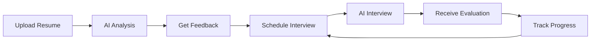

# 🚀 HireReady - AI-Powered Interview Preparation Platform

<div align="center">


[](https://reactjs.org/)
[](https://spring.io/projects/spring-boot)
[](https://www.mongodb.com/)
[](https://www.typescriptlang.org/)

**Master your interview with AI intelligence**

[Features](#-features) • [Architecture](#-solution-architecture) • [Setup](#-getting-started) • [Tech Stack](#-tech-stack) • [Future Scope](#-future-scope)

</div>

---

## 📋 Table of Contents

- [Problem Statement](#-problem-statement)
- [Solution Overview](#-solution-overview)
- [Features](#-features)
- [Solution Architecture](#-solution-architecture)
- [Tech Stack](#-tech-stack)
- [Getting Started](#-getting-started)
- [Project Structure](#-project-structure)
- [API Documentation](#-api-documentation)
- [Screenshots](#-screenshots)
- [Future Scope](#-future-scope)
- [Contributing](#-contributing)
- [License](#-license)

---

## 🎯 Problem Statement

### The Challenge

In today's competitive job market, candidates face multiple challenges:

1. **ATS Rejection**: 75% of resumes are rejected by Applicant Tracking Systems (ATS) before reaching human recruiters
2. **Interview Anxiety**: Lack of realistic practice leads to poor performance in actual interviews
3. **Generic Preparation**: One-size-fits-all interview prep doesn't address individual weaknesses
4. **No Feedback Loop**: Candidates don't know what they're doing wrong without professional coaching
5. **Time Constraints**: Busy professionals struggle to find time for comprehensive interview preparation
6. **Cost Barriers**: Professional interview coaching is expensive and inaccessible to many

### The Impact

- **Job Seekers**: Miss opportunities due to poorly optimized resumes and inadequate interview preparation
- **Companies**: Waste time interviewing unqualified candidates who passed ATS but aren't truly prepared
- **Economy**: Talent mismatch leads to longer hiring cycles and reduced productivity

---

## 💡 Solution Overview

**HireReady** is an AI-powered platform that revolutionizes interview preparation by providing:

- ✅ **Intelligent Resume Analysis**: ATS compatibility scoring with actionable recommendations
- ✅ **Realistic AI Interviews**: Adaptive AI that simulates real interview scenarios
- ✅ **Personalized Feedback**: Detailed analysis of communication, confidence, and technical skills
- ✅ **Progress Tracking**: Comprehensive analytics to monitor improvement over time
- ✅ **24/7 Availability**: Practice anytime, anywhere without scheduling constraints
- ✅ **Affordable Access**: Democratizing interview preparation for everyone

### How It Works



---

## ✨ Features

### 🎓 AI Resume Analyzer

- **ATS Compatibility Scoring**: Get a score out of 100 for how well your resume passes ATS systems
- **Skill Gap Analysis**: Identify missing skills for your target role
- **Personalized Recommendations**: Receive AI-generated suggestions to improve your resume
- **Multi-Format Support**: Upload PDF, images, or text files
- **OCR Technology**: Extract text from images using Tesseract OCR
- **Historical Tracking**: View all past resume analyses and track improvements

### 🤖 AI Interview Simulator

- **Adaptive Difficulty**: AI adjusts question difficulty based on your performance
- **Multiple Interview Types**:
  - Technical Interviews
  - HR/Behavioral Interviews
  - Managerial Interviews
- **Company-Specific Prep**: Practice for specific companies (Google, Amazon, Microsoft, etc.)
- **Role-Based Questions**: Tailored questions for your target position
- **Real-time Interaction**: Natural conversation flow with AI interviewer
- **Scheduled Interviews**: Book practice sessions in advance

### 📊 Smart Analytics Dashboard

- **Profile Score**: Overall readiness metric (0-100)
- **ATS Score**: Latest resume compatibility score
- **Interview Readiness**: Performance-based readiness indicator
- **Progress Tracking**: Visual charts showing improvement over time
- **Performance Metrics**:
  - Total interviews completed
  - Success rate
  - Average score
  - Selected/Rejected/Waitlisted breakdown
- **Historical Data**: Access all past interview reports and evaluations

### 💬 Detailed Feedback System

- **Overall Score**: Comprehensive evaluation (0-100)
- **Decision**: SELECTED / WAITLISTED / REJECTED
- **Strengths**: What you did well
- **Weaknesses**: Areas needing improvement
- **Actionable Improvements**: Specific steps to enhance performance
- **Question-by-Question Analysis**: Individual feedback for each answer
- **Downloadable Reports**: PDF reports for offline review

### 🎯 Additional Features

- **Onboarding Tour**: Interactive guide for new users
- **Toast Notifications**: Real-time feedback for all actions
- **Responsive Design**: Works seamlessly on desktop, tablet, and mobile
- **Dark Theme**: Neural network-inspired design with smooth animations
- **Secure Authentication**: Powered by Clerk for robust user management

---

## 🏗️ Solution Architecture

### System Architecture

```
┌─────────────────────────────────────────────────────────────┐
│                        Frontend Layer                        │
│  ┌──────────────────────────────────────────────────────┐   │
│  │  React 18 + TypeScript + Tailwind CSS                │   │
│  │  - Responsive UI Components                          │   │
│  │  - Framer Motion Animations                          │   │
│  │  - React Three Fiber (3D Graphics)                   │   │
│  │  - Clerk Authentication                              │   │
│  └──────────────────────────────────────────────────────┘   │
└─────────────────────────────────────────────────────────────┘
                              ↕ HTTP/REST
┌─────────────────────────────────────────────────────────────┐
│                         API Layer                            │
│  ┌──────────────────────────────────────────────────────┐   │
│  │  Spring Boot REST Controllers                        │   │
│  │  - Resume Controller                                 │   │
│  │  - Interview Controller                              │   │
│  │  - Live Interview Controller                         │   │
│  │  - Dashboard Controller                              │   │
│  │  - Analytics Controller                              │   │
│  └──────────────────────────────────────────────────────┘   │
└─────────────────────────────────────────────────────────────┘
                              ↕
┌─────────────────────────────────────────────────────────────┐
│                      Service Layer                           │
│  ┌──────────────────────────────────────────────────────┐   │
│  │  Business Logic Services                             │   │
│  │  - Resume Service (PDF/OCR Processing)               │   │
│  │  - Interview Service (Session Management)            │   │
│  │  - AI Service (Gemini & Groq Integration)            │   │
│  │  - Dashboard Service (Metrics Calculation)           │   │
│  └──────────────────────────────────────────────────────┘   │
└─────────────────────────────────────────────────────────────┘
                              ↕
┌─────────────────────────────────────────────────────────────┐
│                      Data Layer                              │
│  ┌──────────────────────────────────────────────────────┐   │
│  │  MongoDB Collections                                 │   │
│  │  - Users                                             │   │
│  │  - Resumes                                           │   │
│  │  - Interview Sessions                                │   │
│  │  - Interview Schedules                               │   │
│  │  - Interview Exchanges                               │   │
│  │  - Interview Evaluations                             │   │
│  └──────────────────────────────────────────────────────┘   │
└─────────────────────────────────────────────────────────────┘
                              ↕
┌─────────────────────────────────────────────────────────────┐
│                   External AI Services                       │
│  ┌──────────────────────────────────────────────────────┐   │
│  │  - Google Gemini AI (Primary)                        │   │
│  │  - Groq API (Fallback/Fast Inference)                │   │
│  │  - Tesseract OCR (Image Text Extraction)             │   │
│  └──────────────────────────────────────────────────────┘   │
└─────────────────────────────────────────────────────────────┘
```

### Data Flow

#### Resume Analysis Flow
```
User Upload → File Validation → Text Extraction (PDF/OCR) 
→ AI Parsing (Gemini) → ATS Analysis (Gemini) 
→ Score Calculation → Store in MongoDB → Return Results
```

#### Interview Flow
```
Schedule Interview → Create Session → Generate Questions (AI)
→ User Answers → AI Evaluation → Calculate Scores
→ Generate Feedback → Store Results → Update User Metrics
```

### Key Architectural Decisions

1. **Microservices-Ready**: Modular service layer allows easy extraction into microservices
2. **RESTful API**: Stateless API design for scalability
3. **NoSQL Database**: MongoDB for flexible schema and fast queries
4. **AI Integration**: Dual AI provider strategy (Gemini + Groq) for reliability
5. **Frontend-Backend Separation**: Independent deployment and scaling
6. **Secure Authentication**: Clerk handles all auth complexity

---

## 🛠️ Tech Stack

### Frontend

| Technology | Purpose | Version |
|------------|---------|---------|
| **React** | UI Library | 18.3.1 |
| **TypeScript** | Type Safety | 5.6.2 |
| **Tailwind CSS** | Styling Framework | 3.4.17 |
| **Framer Motion** | Animations | 11.15.0 |
| **React Three Fiber** | 3D Graphics | 8.17.10 |
| **React Router** | Client-side Routing | 7.1.1 |
| **Clerk** | Authentication | 5.20.0 |
| **Axios** | HTTP Client | 1.7.9 |
| **Lucide React** | Icons | 0.469.0 |
| **jsPDF** | PDF Generation | 2.5.2 |
| **GSAP** | Advanced Animations | 3.12.7 |

### Backend

| Technology | Purpose | Version |
|------------|---------|---------|
| **Spring Boot** | Framework | 3.x |
| **Java** | Language | 17+ |
| **MongoDB** | Database | Latest |
| **Google Gemini AI** | Primary AI | Latest |
| **Groq API** | Fast AI Inference | Latest |
| **Apache PDFBox** | PDF Processing | 3.0.3 |
| **Tesseract OCR** | Image Text Extraction | 5.x |
| **Lombok** | Boilerplate Reduction | Latest |
| **Gson** | JSON Processing | 2.11.0 |

### Development Tools

- **Vite**: Frontend build tool
- **Maven**: Backend dependency management
- **Git**: Version control
- **VS Code**: Recommended IDE

---

## 🚀 Getting Started

### Prerequisites

- **Node.js** (v18 or higher)
- **Java** (JDK 17 or higher)
- **MongoDB** (v6 or higher)
- **Maven** (v3.8 or higher)
- **Tesseract OCR** (for image processing)

### Environment Variables

#### Frontend (.env)
```env
VITE_API_URL=http://localhost:8080/api
VITE_CLERK_PUBLISHABLE_KEY=your_clerk_publishable_key
```

#### Backend (application.properties)
```properties
# MongoDB
spring.data.mongodb.uri=mongodb://localhost:27017/hireready

# AI API Keys
gemini.api.key=your_gemini_api_key
groq.api.key=your_groq_api_key

# Clerk
clerk.secret.key=your_clerk_secret_key

# CORS
cors.allowed.origins=http://localhost:5173

# Tesseract
tesseract.path=/usr/local/bin/tesseract
```

### Installation & Setup

#### 1. Clone the Repository
```bash
git clone https://github.com/yourusername/HireReady.git
cd HireReady
```

#### 2. Backend Setup
```bash
cd backend

# Install dependencies
mvn clean install

# Run the application
mvn spring-boot:run
```

Backend will start on `http://localhost:8080`

#### 3. Frontend Setup
```bash
cd frontend

# Install dependencies
npm install

# Start development server
npm run dev
```

Frontend will start on `http://localhost:5173`

#### 4. MongoDB Setup
```bash
# Start MongoDB
mongod --dbpath /path/to/data/directory

# Or using Docker
docker run -d -p 27017:27017 --name mongodb mongo:latest
```

#### 5. Tesseract OCR Setup

**macOS:**
```bash
brew install tesseract
```

**Ubuntu/Debian:**
```bash
sudo apt-get install tesseract-ocr
```

**Windows:**
Download from: https://github.com/UB-Mannheim/tesseract/wiki

### First Run

1. Navigate to `http://localhost:5173`
2. Sign up using Clerk authentication
3. Complete the onboarding tour
4. Upload your resume for analysis
5. Schedule your first AI interview

---

## 📁 Project Structure

```
HireReady/
├── backend/
│   ├── src/
│   │   ├── main/
│   │   │   ├── java/com/hireready/
│   │   │   │   ├── controller/          # REST Controllers
│   │   │   │   │   ├── AuthController.java
│   │   │   │   │   ├── ResumeController.java
│   │   │   │   │   ├── InterviewController.java
│   │   │   │   │   └── LiveInterviewController.java
│   │   │   │   ├── service/             # Business Logic
│   │   │   │   │   ├── AIService.java
│   │   │   │   │   ├── ResumeService.java
│   │   │   │   │   ├── InterviewService.java
│   │   │   │   │   └── DashboardService.java
│   │   │   │   ├── model/               # Data Models
│   │   │   │   │   ├── User.java
│   │   │   │   │   ├── Resume.java
│   │   │   │   │   ├── InterviewSession.java
│   │   │   │   │   └── InterviewEvaluation.java
│   │   │   │   ├── repository/          # MongoDB Repositories
│   │   │   │   ├── dto/                 # Data Transfer Objects
│   │   │   │   ├── exception/           # Custom Exceptions
│   │   │   │   └── HireReadyApplication.java
│   │   │   └── resources/
│   │   │       └── application.properties
│   │   └── test/                        # Unit Tests
│   └── pom.xml                          # Maven Dependencies
│
├── frontend/
│   ├── src/
│   │   ├── components/                  # Reusable Components
│   │   │   ├── Sidebar.tsx
│   │   │   ├── Card.tsx
│   │   │   ├── ToastNotification.tsx
│   │   │   ├── OnboardingTour.tsx
│   │   │   ├── InterviewAnalytics.tsx
│   │   │   └── ScheduledInterviewsList.tsx
│   │   ├── pages/                       # Page Components
│   │   │   ├── Landing.tsx
│   │   │   ├── Dashboard.tsx
│   │   │   ├── ResumeAnalyzer.tsx
│   │   │   ├── InterviewSimulator.tsx
│   │   │   ├── LiveInterviewRoom.tsx
│   │   │   └── Analytics.tsx
│   │   ├── services/                    # API Services
│   │   │   └── api.ts
│   │   ├── App.tsx                      # Main App Component
│   │   ├── main.tsx                     # Entry Point
│   │   └── index.css                    # Global Styles
│   ├── public/                          # Static Assets
│   ├── package.json                     # NPM Dependencies
│   ├── tsconfig.json                    # TypeScript Config
│   ├── tailwind.config.js               # Tailwind Config
│   └── vite.config.ts                   # Vite Config
│
└── README.md                            # This File
```

---

## 📡 API Documentation

### Base URL
```
http://localhost:8080/api
```

### Authentication
All protected endpoints require Clerk authentication token in headers:
```
Authorization: Bearer <clerk_token>
```

### Endpoints

#### Resume APIs

| Method | Endpoint | Description |
|--------|----------|-------------|
| POST | `/resume/analyze` | Analyze uploaded resume |
| GET | `/resume/report/{userId}` | Get latest resume report |
| GET | `/resume/history/{userId}` | Get all resume analyses |
| GET | `/resume/{resumeId}` | Get specific resume |
| DELETE | `/resume/{resumeId}` | Delete resume |

#### Interview APIs

| Method | Endpoint | Description |
|--------|----------|-------------|
| POST | `/interview/schedule` | Schedule new interview |
| GET | `/interview/schedules/{userId}` | Get user's schedules |
| DELETE | `/interview/schedule/{scheduleId}` | Delete schedule |
| POST | `/interview/live/start` | Start live interview |
| POST | `/interview/live/next-question` | Get next question |
| POST | `/interview/live/end` | End interview |
| GET | `/interview/live/report/{sessionId}` | Get evaluation report |

#### Dashboard APIs

| Method | Endpoint | Description |
|--------|----------|-------------|
| GET | `/user/dashboard-metrics/{userId}` | Get dashboard metrics |

#### Analytics APIs

| Method | Endpoint | Description |
|--------|----------|-------------|
| GET | `/analytics/interviews/{userId}` | Get interview analytics |

### Example Request: Analyze Resume

```bash
curl -X POST http://localhost:8080/api/resume/analyze \
  -H "Content-Type: multipart/form-data" \
  -F "userId=user_123" \
  -F "file=@resume.pdf" \
  -F "targetRole=Software Engineer"
```

### Example Response

```json
{
  "success": true,
  "message": "Resume analyzed successfully",
  "data": {
    "id": "resume_456",
    "userId": "user_123",
    "fileName": "resume.pdf",
    "atsScore": 85.5,
    "skills": ["Java", "Spring Boot", "React", "MongoDB"],
    "weaknesses": ["Missing quantifiable achievements"],
    "recommendations": ["Add metrics to your accomplishments"],
    "analyzedAt": "2025-12-26T21:00:00Z"
  }
}
```

---

## 📸 Screenshots

### Landing Page


### Dashboard


### Resume Analyzer


### Live Interview


### Analytics


---

## 🔮 Future Scope

### Short-term Enhancements (Next 3-6 months)

1. **Video Interview Simulation**
   - Webcam integration for facial expression analysis
   - Body language feedback using computer vision
   - Eye contact tracking

2. **Voice Analysis**
   - Speech-to-text for answer recording
   - Tone and pace analysis
   - Filler word detection (um, uh, like)

3. **Mock Interview Rooms**
   - Multi-user interview practice
   - Peer-to-peer feedback
   - Group discussion simulations

4. **Enhanced Resume Builder**
   - AI-powered resume templates
   - Real-time ATS optimization suggestions
   - One-click resume generation

5. **Mobile Applications**
   - iOS app (React Native)
   - Android app (React Native)
   - Push notifications for scheduled interviews

### Mid-term Enhancements (6-12 months)

1. **Industry-Specific Modules**
   - Healthcare interview prep
   - Finance & Banking scenarios
   - Legal profession preparation
   - Engineering specializations

2. **Multilingual Support**
   - Support for 10+ languages
   - Regional interview customs
   - Cultural adaptation tips

3. **AI Interview Coach**
   - Personalized learning paths
   - Adaptive curriculum based on weaknesses
   - Daily practice recommendations

4. **Integration with Job Boards**
   - LinkedIn integration
   - Indeed job matching
   - Direct application from platform

5. **Gamification**
   - Achievement badges
   - Leaderboards
   - Streak tracking
   - Reward points system

### Long-term Vision (1-2 years)

1. **Enterprise Solutions**
   - Corporate training modules
   - Bulk user management
   - Custom company interview scenarios
   - White-label solutions

2. **AI-Powered Career Counseling**
   - Career path recommendations
   - Skill gap analysis for career transitions
   - Salary negotiation coaching
   - Long-term career planning

3. **Virtual Reality Interviews**
   - VR headset support
   - Immersive interview environments
   - Realistic office simulations

4. **Blockchain Credentials**
   - Verified skill certificates
   - Interview performance NFTs
   - Portable career credentials

5. **Advanced Analytics**
   - Predictive success modeling
   - Industry benchmark comparisons
   - Hiring trend analysis
   - Personalized market insights

### Research & Innovation

- **Emotion AI**: Detect and provide feedback on emotional intelligence
- **Bias Detection**: Identify and eliminate unconscious bias in responses
- **Neuroscience Integration**: Brain-computer interfaces for stress management
- **Quantum Computing**: Ultra-fast AI processing for real-time feedback

---

## 🤝 Contributing

We welcome contributions! Please follow these steps:

1. Fork the repository
2. Create a feature branch (`git checkout -b feature/AmazingFeature`)
3. Commit your changes (`git commit -m 'Add some AmazingFeature'`)
4. Push to the branch (`git push origin feature/AmazingFeature`)
5. Open a Pull Request

### Coding Standards

- **Frontend**: Follow React best practices, use TypeScript strictly
- **Backend**: Follow Spring Boot conventions, use Lombok annotations
- **Commits**: Use conventional commits (feat, fix, docs, style, refactor, test, chore)
- **Testing**: Write unit tests for all new features

---

## 📄 License

This project is licensed under the MIT License - see the [LICENSE](LICENSE) file for details.

---

## 👥 Team

- **Project Lead**: [Your Name]
- **Frontend Developer**: [Developer Name]
- **Backend Developer**: [Developer Name]
- **AI/ML Engineer**: [Developer Name]
- **UI/UX Designer**: [Designer Name]

---

## 📞 Contact & Support

- **Email**: support@hireready.com
- **Website**: https://hireready.com
- **Documentation**: https://docs.hireready.com
- **Discord**: https://discord.gg/hireready
- **Twitter**: [@HireReadyAI](https://twitter.com/HireReadyAI)

---

## 🙏 Acknowledgments

- **Google Gemini AI** for powerful language models
- **Groq** for fast AI inference
- **Clerk** for seamless authentication
- **MongoDB** for flexible data storage
- **React Community** for amazing libraries
- **Spring Boot Team** for robust framework
- **Open Source Community** for inspiration and tools

---

## 📊 Project Stats


---

<div align="center">

**Made with ❤️ by the HireReady Team**

**Star ⭐ this repository if you find it helpful!**

[Back to Top](#-hireready---ai-powered-interview-preparation-platform)

</div>
